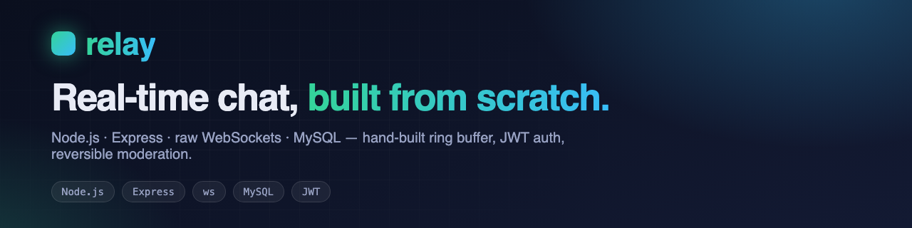
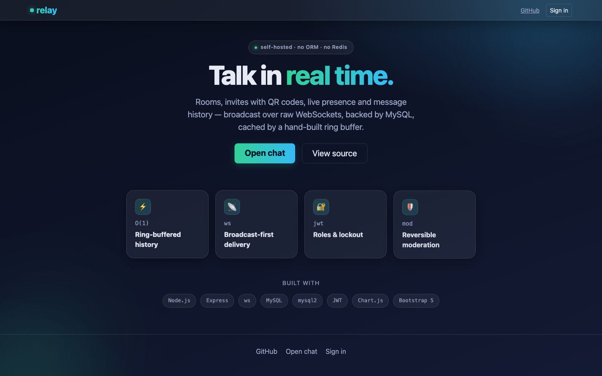
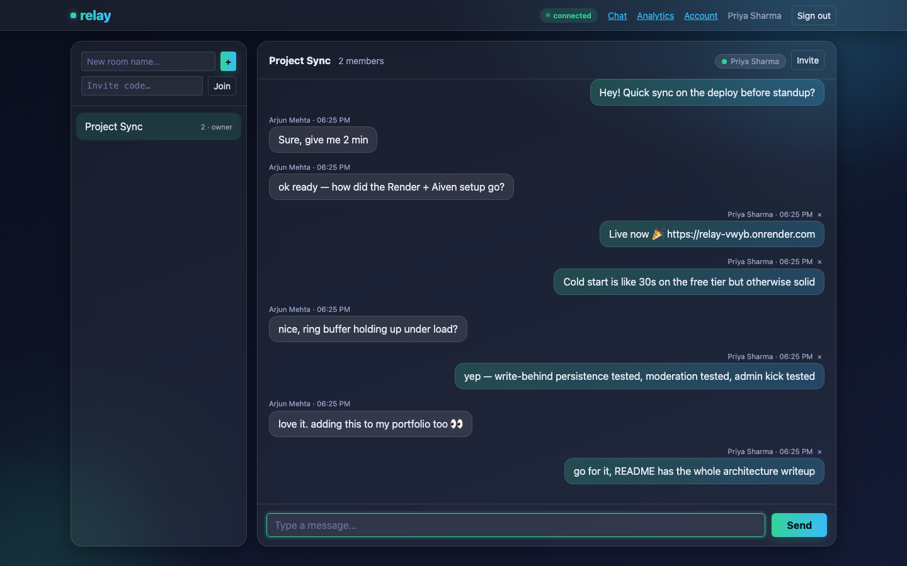
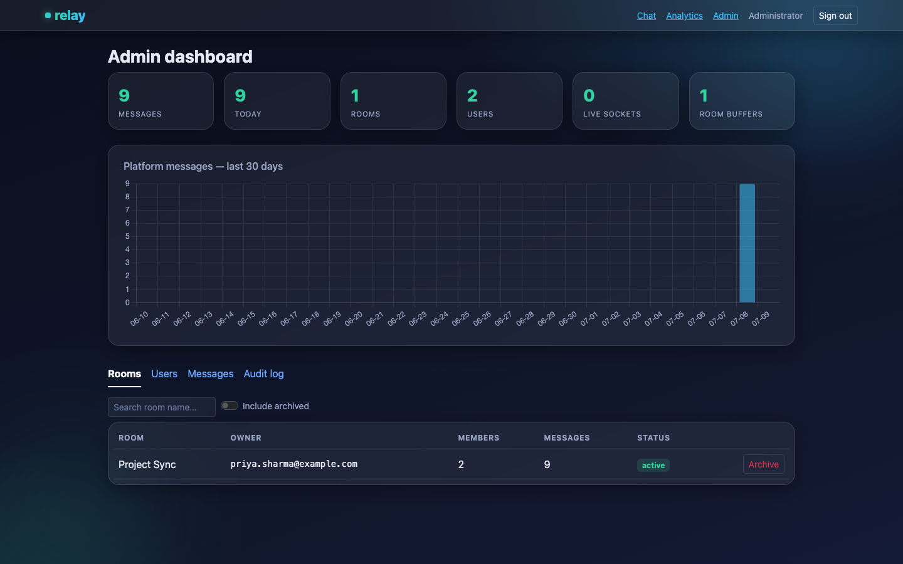
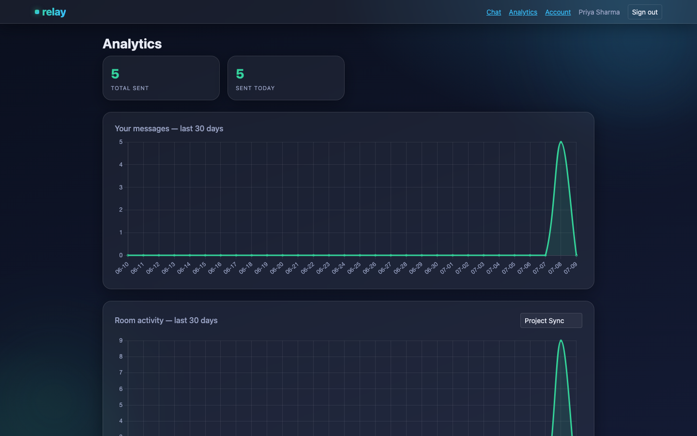
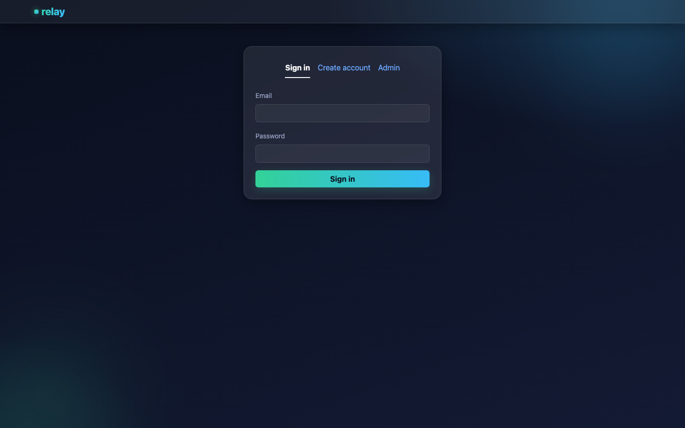

<p align="center">
  
</p>

<h1 align="center">Relay</h1>

<p align="center">
  <strong>A production-style real-time chat app built with Node.js, Express &amp; MySQL</strong><br/>
  Raw WebSockets, a hand-built O(1) ring buffer on the message hot path, role-based JWT auth with account lockout, and fully reversible admin moderation — no Redis, no ORM, no Socket.IO.
</p>

<p align="center">
  <a href="https://github.com/dipakpm59/relay/actions/workflows/ci.yml"></a>
  =18" />
  
  
  
  <a href="LICENSE"></a>
</p>

<p align="center">
  <a href="#live-demo">Live Demo</a> ·
  <a href="#features">Features</a> ·
  <a href="#architecture">Architecture</a> ·
  <a href="#getting-started-local">Installation</a> ·
  <a href="#deploying">Deployment</a> ·
  <a href="#api-reference">API Docs</a> ·
  <a href="#faq">FAQ</a>
</p>

---

## Table of Contents

- [Live Demo](#live-demo)
- [Features](#features)
- [Screenshots](#screenshots)
- [Architecture](#architecture)
- [The hot path: broadcast first, persist async](#the-hot-path-broadcast-first-persist-async)
- [Security model](#security-model)
- [The WebSocket protocol](#the-websocket-protocol)
- [Tech Stack](#tech-stack)
- [Getting started (local)](#getting-started-local)
- [Environment Variables](#environment-variables)
- [Deploying](#deploying)
- [Testing](#testing)
- [API reference](#api-reference)
- [Pages](#pages)
- [Future Enhancements](#future-enhancements)
- [FAQ](#faq)
- [Author](#author)
- [License](#license)

## Live Demo

**https://relay-vwyb.onrender.com** — free-tier hosting (Render + Aiven MySQL), so it sleeps after ~15 min idle and the first request takes 30-60s to wake up. Everything after that is live: registration, real-time chat between two browser sessions, admin moderation, analytics.

Sign in at `/login` — **Create account** self-serves regular users; the **Admin** tab uses the seeded admin account.

## Features

| | | |
|---|---|---|
| ⚡ **Ring-buffered history** | Hand-built, from-scratch O(1) circular buffer sits in front of MySQL for each room's recent messages — no Redis. | [How it works ↓](#the-hot-path-broadcast-first-persist-async) |
| 📡 **Broadcast-first delivery** | Messages reach every socket in the room before the MySQL `INSERT` even starts — write-behind persistence backfills the id after. | [Hot path ↓](#the-hot-path-broadcast-first-persist-async) |
| 🔐 **Role-based JWT auth** | HttpOnly cookie carries only `{ id, role }`; verified at every HTTP request *and* the WebSocket handshake. Account lockout after repeated failures. | [Security model ↓](#security-model) |
| 🛡️ **Reversible moderation** | Soft-delete/restore for messages and rooms — authors, room owners, and admins each have exactly the permissions they should. | [Security model ↓](#security-model) |
| 📶 **Live presence** | Per-room online lists pushed over the socket as members join/leave, with heartbeat ping/pong reaping dead connections. | [WS protocol ↓](#the-websocket-protocol) |
| 🧑‍💼 **Admin dashboard** | Live socket/buffer stats, user management with instant kick-on-deactivate, room archive/restore, full audit log. | [Screenshots ↓](#screenshots) |
| 📊 **Analytics** | Chart.js line charts for personal and per-room message activity over the last 30 days. | [Screenshots ↓](#screenshots) |
| 🔗 **QR-code invites** | Every room gets an invite code and a scannable QR code, generated server-side. | — |
| 🧱 **Hardened by default** | Helmet CSP, tiered rate limiting, HPP, recursive XSS sanitization on every input — including WS frames, which never touch Express middleware. | [Security model ↓](#security-model) |

## Screenshots

| Landing page | Live chat |
|---|---|
|  |  |

| Admin dashboard | Analytics |
|---|---|
|  |  |

<details>
<summary>Login page</summary>


</details>

## Architecture

Layered MVC + Service pattern, with a WebSocket gateway that reuses the exact same services as the HTTP layer:

```
HTTP:  Router → Controller → Validator → Service → Model/Buffer
WS:    Gateway → Handler   → Validator → Service → Model/Buffer
```

Controllers hold no business logic; services never touch `req`/`res` or a socket — which is exactly why the WS gateway can call `messageService.postMessage()` and the HTTP layer can call `messageService.removeMessage()` with the same rules applied everywhere.

<details>
<summary><strong>Folder structure</strong></summary>

```
src/config/       env loading (local DB_* vars or MYSQL_URL), MySQL pool
src/constants/    HTTP status codes, WS event names, user-facing messages
src/models/       parameterized SQL query modules (no ORM)
src/validators/   message / room / auth rules (+ xss sanitization)
src/structures/   the O(1) ring buffer (pure class, zero imports → unit-testable)
src/services/     business logic: message, room, auth, user, analytics
src/controllers/  thin req/res translation only
src/ws/           the WebSocket gateway (handshake, routing, presence, heartbeat)
src/routes/       Express routers (+ page routes)
src/middleware/   auth (JWT), security stack, rate limits, central errors
src/utils/        logger, jwt, password, AppError, asyncHandler
src/scripts/      db:init (migration runner), db:seed (admin account)
migrations/       numbered .sql files, tracked in schema_migrations
test/             node:test unit tests (no Jest/Mocha)
views/            HTML + Bootstrap 5 glass dark theme + Chart.js + WS client
docs/             screenshots, banner
logs/             app.log · error.log · request.log
```
</details>

## The hot path: broadcast first, persist async

```
WS frame {type:"message"} arrives
  ├─ validate + sanitize body
  ├─ shared membership guard (roomService.assertMember)
  ├─ daily limit check (seeded once from MySQL, counted in memory)
  ├─ push onto the room's ring buffer          ← O(1), in memory
  ├─ BROADCAST to everyone in the room         ← users see it NOW
  └─ INSERT into MySQL in the background       ← write-behind; the id is
                                                 backfilled onto the same
                                                 object the buffer holds
```

Opening a room serves its recent history straight from the buffer. A cold buffer (fresh boot) hydrates once from MySQL, then never reads again. Older history is paginated from MySQL over HTTP with an id cursor.

**Why a ring buffer here, and not an LRU cache?** Chat wants the *newest* N items per room: bounded memory, oldest silently overwritten — a circular array does that in O(1) with no pointer bookkeeping. An LRU is the right structure when you want the most *reused* keys out of an unbounded key space (recency-of-access); a chat room's history isn't that — it's strictly recency-of-arrival.

## Security model

- **JWT carries only `{ id, role }`** in an **HttpOnly cookie** (JS never sees it). Every protected HTTP request *and* the WebSocket upgrade verify the signature, then re-load the account from the table matching the **signed role claim** and re-check `is_active` / `locked_until`.
- **Socket identity is server-side.** Every event handler reads the sender from `client.user` (set at the handshake), never from a `userId`/`role` field in the frame. A client cannot speak as another user or claim to be an owner.
- **Account lockout**: `MAX_LOGIN_ATTEMPTS` consecutive failures lock the account for `LOCKOUT_MINUTES`. Admins can unlock. Unknown email and wrong password return the same generic error.
- **Deactivation is immediate**: an admin disabling a user closes their live sockets (`gateway.kickUser`) — verified end-to-end, the socket closes within a second of the API call.
- **Audit trail**: every mutating admin action lands in `admin_logs`, browsable in the dashboard.
- **Hardening**: `helmet` (CSP allows `ws:`/`wss:`), tiered `express-rate-limit` (auth < rooms < general), `hpp`, recursive `xss` sanitization on HTTP inputs — and message bodies are sanitized in the **shared validator**, because WS frames never pass through Express middleware. Plus WS basics: Origin check at upgrade, `maxPayload`, heartbeat ping/pong reaping dead sockets, and a minimum interval between messages per socket.

## The WebSocket protocol

Small, documented JSON frames (see `src/constants/wsEvents.js`). Connect to `/ws`; the cookie authenticates the upgrade.

| Direction | Frame | Payload |
|---|---|---|
| C→S | `join` | `{ roomId }` |
| C→S | `leave` | `{ roomId }` |
| C→S | `message` | `{ roomId, body, clientId }` |
| S→C | `ready` | `{ user }` (sent on connect) |
| S→C | `joined` | `{ roomId, messages, online }` |
| S→C | `message` | `{ message, clientId }` (broadcast) |
| S→C | `removed` / `restored` | `{ roomId, messageId }` / `{ roomId, message }` |
| S→C | `presence` | `{ roomId, online }` |
| S→C | `error` | `{ message, ref? }` |

The browser client (`views/assets/js/chat.js`) is a hand-written wrapper with reconnect + exponential backoff (1s → 15s), re-joining the current room on reconnect.

## Tech Stack

**Backend:** Node.js, Express, MySQL (via `mysql2`), `ws`, JWT (`jsonwebtoken`), bcrypt (`bcryptjs`)
**Frontend:** Server-rendered HTML, Bootstrap 5, vanilla JavaScript, Chart.js
**Security:** Helmet, `express-rate-limit`, `hpp`, `xss`, CORS
**Other:** `qrcode` (invite QR generation), `nanoid` (invite codes), `node:test` (unit tests, no Jest/Mocha)
**Deployment:** Render (web service) + Aiven (managed MySQL), or Railway as an alternative

## Getting started (local)

Prerequisites: Node.js ≥ 18 and MySQL 8.

```bash
npm install
cp .env.example .env      # set DB_PASSWORD, a long random JWT_SECRET,
                          # and your ADMIN_EMAIL / ADMIN_PASSWORD
npm run db:init           # creates DB + applies migrations/ in order
npm run db:seed           # creates the admin account from .env
npm run dev               # http://localhost:3000
```

Sign in at `/login` — **Create account** self-serves users; the **Admin** tab uses the seeded account. Open `/chat` in two browsers (or a normal + private window) with different accounts to watch live broadcast, presence, and moderation.

## Environment Variables

See [.env.example](.env.example) for the complete, always-up-to-date list with defaults. The important ones:

| Variable | Purpose |
|---|---|
| `PORT`, `BASE_URL`, `CORS_ORIGIN` | Server port and public URL(s) |
| `DB_HOST` / `DB_PORT` / `DB_USER` / `DB_PASSWORD` / `DB_NAME` | Local MySQL connection (ignored if `MYSQL_URL` is set) |
| `MYSQL_URL` | Single connection string — overrides all `DB_*` vars (used on Render/Railway) |
| `DB_SSL` | Set `true` for managed MySQL providers that require TLS (e.g. Aiven) |
| `JWT_SECRET`, `JWT_EXPIRES_IN` | Signing key and session lifetime |
| `MAX_LOGIN_ATTEMPTS`, `LOCKOUT_MINUTES` | Account lockout thresholds |
| `ADMIN_NAME` / `ADMIN_EMAIL` / `ADMIN_PASSWORD` | Used once by `npm run db:seed` |
| `BUFFER_CAPACITY` | Ring buffer size per room |
| `DAILY_MESSAGE_LIMIT`, `MESSAGE_MAX_LENGTH` | Per-user chat limits |
| `RATE_WINDOW_MINUTES`, `RATE_MAX_GENERAL`, `RATE_MAX_ROOMS`, `RATE_MAX_AUTH` | Tiered rate limiting |

## Deploying

Either target needs a host with persistent WebSockets (rules out Vercel/Netlify's serverless model) plus a managed MySQL instance.

### Render + Aiven (free, no credit card — what the live demo runs on)

1. Push to GitHub, create a Render **Web Service from the repo** (this repo includes a `render.yaml` blueprint).
2. Create an Aiven MySQL service on the free plan — only available on **DigitalOcean/UpCloud** clouds, not AWS/GCP/Azure: `avn service create <name> --service-type mysql --plan free-1-1gb --cloud do-<region>`.
3. On the Render service → Environment:
   - `MYSQL_URL` = Aiven's service URI with `?ssl-mode=REQUIRED` appended
   - `DB_SSL` = `true` (managed MySQL requires TLS; `env.js` also honors `ssl-mode` inside `MYSQL_URL` itself)
   - `JWT_SECRET` = a long random string
   - `NODE_ENV` = `production`
   - `BASE_URL` and `CORS_ORIGIN` = your Render public URL
   - `ADMIN_EMAIL` / `ADMIN_PASSWORD` / `ADMIN_NAME`
4. Once: run `npm run db:init && npm run db:seed` locally with `MYSQL_URL`/`DB_SSL` pointed at Aiven (`db:init` skips `CREATE DATABASE` gracefully if the plan doesn't grant that privilege — Aiven's free tier pre-creates `defaultdb`).
5. `trust proxy` is set, so secure cookies and real IPs work behind Render's proxy. The client picks `wss://` automatically on HTTPS.

### Railway (paid, single-dashboard setup)

Railway bundles WebSockets and managed MySQL in one place, trading the permanent free tier for simplicity.

1. Push to GitHub, create a Railway project **from the repo**.
2. Add the **MySQL** plugin.
3. Same env vars as above, but `MYSQL_URL` = `${{ MySQL.MYSQL_URL }}` — no `DB_SSL`/`ssl-mode` needed, Railway's internal MySQL doesn't require TLS.
4. Once: `railway run npm run db:init && railway run npm run db:seed`
5. Railway starts `npm start` automatically.

**Known limitation (and a great interview answer):** the ring buffers and presence map live in the process, so they reset on redeploy and aren't shared across instances. Scaling past one instance means moving them to Redis with pub/sub for cross-instance broadcast. Everything else is stateless.

## Testing

```bash
npm test        # node --test  (built-in runner, no Jest/Mocha)
```

CI runs this on every push/PR against Node 18.x and 20.x — see [.github/workflows/ci.yml](.github/workflows/ci.yml).

- `ringBuffer.test.js` — eviction/wrap-around order, `last(n)` windows, in-place mutation, stats (pure, no mocks)
- `message.service.test.js` — validation, XSS sanitization, membership guard, daily limit seeded once, **write-behind** (message returns before the INSERT, id backfills after), cold-buffer hydration hits MySQL exactly once, buffer wrap, moderation permissions
- `auth.service.test.js` — registration rules, bcrypt hashing, minimal JWT claims, the full lockout flow, deactivated accounts
- `room.service.test.js` — name rules, owner membership on create, invite validation, owner-cannot-leave, owner/admin-only rename & archive

Services are tested without Express, MySQL, or a socket by monkey-patching the model modules (`test/helpers.js`).

## API reference

**Auth** `/api/auth` — `POST /register` · `POST /login` · `POST /admin/login` · `POST /logout` · `GET /me`

**Users** `/api/users` (auth) — `GET /me` (profile + daily usage) · `PATCH /me` · `PATCH /me/password`

**Rooms** `/api/rooms` (auth) — `POST /` (create) · `GET /` (mine) · `POST /join` (invite code) · `GET /:id/qr` · `GET /:id/members` · `GET /:id/messages?beforeId=` (older history) · `POST /:id/leave` · `PATCH /:id` (rename) · `PATCH /:id/archive` · `PATCH /:id/restore`

**Messages** `/api/messages` (auth) — `DELETE /:id` (author/owner/admin) · `PATCH /:id/restore` (owner/admin)

**Analytics** `/api/analytics` (auth) — `GET /summary` · `GET /rooms/:id`

**Admin** `/api/admin` (admin role) — `GET /overview` (totals + **live** sockets/buffers) · `GET /rooms` · `PATCH /rooms/:id/archive|restore` · `GET /users` · `PATCH /users/:id` · `PATCH /users/:id/unlock` · `GET /messages` · `DELETE /messages/:id` · `PATCH /messages/:id/restore` · `GET /logs`

Example — register and create a room:

```bash
curl -c cookies.txt -X POST https://relay-vwyb.onrender.com/api/auth/register \
  -H "Content-Type: application/json" \
  -d '{"name":"Ada","email":"ada@example.com","password":"SecurePass123!"}'

curl -b cookies.txt -X POST https://relay-vwyb.onrender.com/api/rooms \
  -H "Content-Type: application/json" \
  -d '{"name":"General"}'
```

All auth is via the `token` HttpOnly cookie set on register/login — there's no bearer-token mode.

## Pages

`/` landing · `/login` (sign in / register / admin) · `/chat` (rooms, live messages, presence, invite QR) · `/join/:code` (invite landing) · `/account` · `/analytics` · `/admin` · styled 404/500.

## Future Enhancements

- [ ] Move the ring buffer + presence map to Redis (pub/sub) to support horizontal scaling past one instance
- [ ] Refresh tokens / JWT revocation for true session invalidation before expiry
- [ ] A visible audit-log page filterable by admin/action (data already captured in `admin_logs`)
- [ ] Typing indicators and read receipts over the existing WS protocol
- [ ] A public `GET /healthz` liveness route for automated platform health checks
- [ ] File/image attachments in messages

## FAQ

**Why a ring buffer instead of just querying MySQL every time?** A chat room's "recent messages" view is read constantly and changes with every message. Serving it from an in-memory O(1) circular buffer means zero MySQL round-trips on the common path — MySQL is only hit once per room (cold-boot hydration) and in the background for persistence.

**Why is the JWT in a cookie instead of `localStorage`?** `localStorage` is readable by any JavaScript on the page, including an XSS payload — a single XSS bug means the token is stolen. An `HttpOnly` cookie is invisible to JavaScript entirely, and it's verified again at the WebSocket handshake, not just on HTTP requests.

**Is this using an ORM?** No — every query is hand-written in `src/models/*.model.js` using `mysql2`'s parameterized placeholders. Deliberate choice: understanding exactly what SQL runs, when, and why.

**Why MySQL instead of PostgreSQL/MongoDB?** The project targets a raw-SQL, no-ORM approach with a relational schema (users/rooms/messages/room_members with foreign keys) — MySQL was the target from the start, and Railway/Render+Aiven both offer managed MySQL.

**Can I run this without MySQL, just to look at the frontend?** Not currently — the app requires a live MySQL connection and runs migrations against it before it'll serve requests. Easiest path: use the [live demo](#live-demo) instead.

## Author

**Dipak** — GitHub: [@dipakpm59](https://github.com/dipakpm59)

## License

[MIT](LICENSE)
